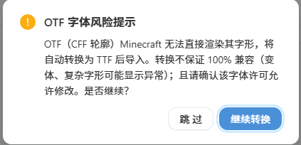
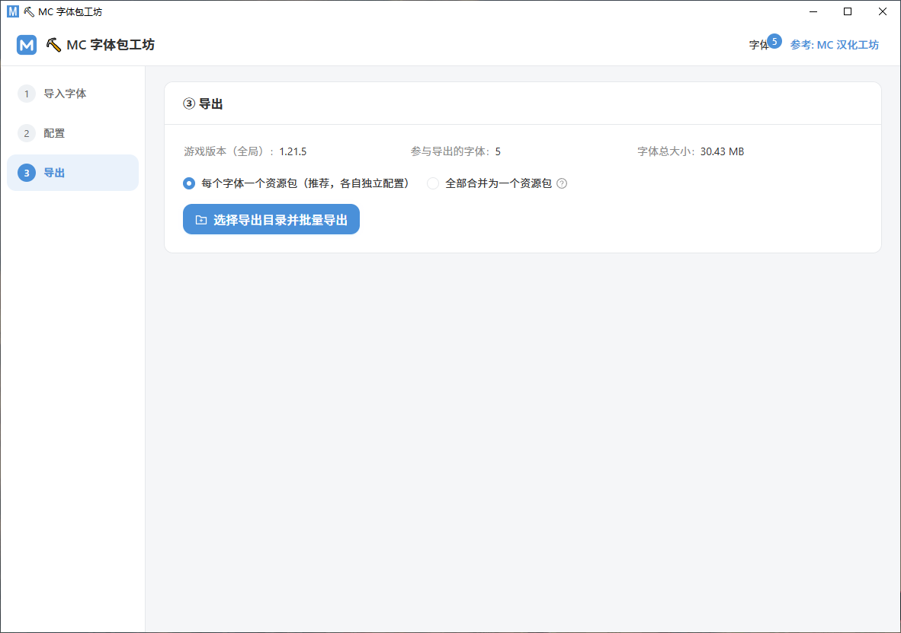

# ⛏ MC 字体包工坊（MC Font Workshop）

《我的世界》字体资源包生成器桌面工具：导入字体 → 独立配置 → 一键导出可用的资源包 zip。

- 技术栈：Tauri v2 + React + TypeScript + antd + Rust
- 主题：白亮 + 天空蓝

## 功能

### ① 导入字体

点击选择 / 拖入字体文件（`.ttf` / `.otf` / `.woff` / `.woff2`，可多选），自动校验文件头魔数；字体卡片显示名称 / 格式 / 大小，Canvas 实时预览字形（可输入任意文字预览字形效果）；导入时自动初始化配置，资源包名称与 description 默认 = 字体文件名。


**自动转换**：OTF（CFF 轮廓）Minecraft 无法直接渲染，导入时自动转 TTF（内置 fontTools 转换器）；WOFF / WOFF2 自动解包为 TTF。转换前会弹风险提示确认。



### ② 配置

- **全局配置**（应用到所有字体）：目标游戏版本（自动匹配 pack_format，1.21.9+ 改用 `min_format`/`max_format`，可手动指定）、高级参数（文字大小 / 水平·垂直偏移 / 渲染清晰度）、封面生成（按字体名 / 自定义文字 / 自定义图片 / 不生成）
- **每个字体独立配置**（左侧切换）：资源包名称、namespace、覆盖模式（覆盖默认字体 / 附加自定义字体）、description（§ 格式码编辑器 + 实时预览、中英双语）、封面（无 / 自定义图片 / 用该字体生成）


### ③ 导出

**每个字体一个资源包**（默认，各自独立配置）或 **全部合并为一个资源包**；生成 `pack.mcmeta` + `assets/<ns>/font/*.json` + 字体文件（文件名自动转为 Minecraft 合法的小写 ASCII），封面写入 `pack.png`；导出后写回校验（条目存在且非空），结果列表展示每个 zip 并支持「打开目录」。



## 安装包

从 [GitHub Releases](https://github.com/adssadax-1/mc-font-workshop/releases) 下载最新安装包（Windows），或自行构建：

```bash
npm install
cd src-tauri && python -m pip install fonttools brotli pyinstaller
python -m PyInstaller --onefile --name font-converter convert_font.py
cp dist/font-converter.exe ./
cd ..
npm run tauri build   # 安装包输出到 src-tauri/target/release/bundle/
```

安装包内置字体转换器（font-converter.exe），无需额外安装 Python。

## 开发运行

```bash
npm install
npm run tauri dev
```

开发环境转换字体优先使用 `src-tauri/font-converter.exe`（若存在），否则回退到 Python + `convert_font.py`。

## 测试

```bash
cd src-tauri && cargo test
```

## 项目结构

- `src/` — React 前端（antd，白亮 + 天空蓝主题）
  - `components/` — ImportStep / ConfigStep（全局配置 + 每字体 Tab）/ ExportStep / CoverPanel / FormatPreview / DescriptionEditor
  - `cover.ts` — 封面生成（图片转 128x128 PNG、字体渲染文字封面）
  - `minecraftFormat.tsx` — § 格式码解析与渲染
- `src-tauri/src/`
  - `pack_format.rs` — pack_format 全版本对照（含 26.x 版本区间）
  - `font_validate.rs` — 字体魔数校验
  - `generate.rs` — mcmeta / font json 生成、zip 打包、写后校验、批量导出
  - `lib.rs` — Tauri commands（validate_font / convert_font / pack_format_for_version / export_pack / export_multi / open_in_explorer）
- `src-tauri/convert_font.py` — OTF→TTF 转换、WOFF/WOFF2 解包（fontTools，打包为 font-converter.exe）

## 版权声明 ⚠️

**本工具不内置、不传播任何商用字体或受版权保护的字体资源。**

请用户在使用前确认：

1. **字体许可**：你导入的字体必须是本人合法获得、且**允许修改与再分发**的。绝大多数商业字体（如汉仪、方正等需付费授权的字体，以及标明"禁止修改"的字体）**禁止**转换格式、嵌入资源包或再分发——**将 OTF 转换为 TTF 也属于对字体的修改**，同样受许可条款约束。
2. **导出物责任**：使用本工具生成的字体资源包，其字体内容、描述、封面等全部来自用户自行导入的文件。**若你分享、发布、商用导出的资源包，由此产生的任何版权侵权风险与法律责任由你自行承担**，工具作者不承担连带责任。
3. **建议**：分享字体包前，请优先使用开源/免费可商用字体（如 OFL 协议字体、思源黑体、Noto 系列等），并保留其许可声明。
4. **隐私**：本工具完全本地运行，不收集、不上传任何用户数据。

## 开源协议

[MIT](LICENSE)。

> 本许可证仅适用于本工具自身的源代码与可执行文件；用户导入/转换/导出的**字体内容**不适用本许可证，其使用权遵循各字体自身的许可协议。
